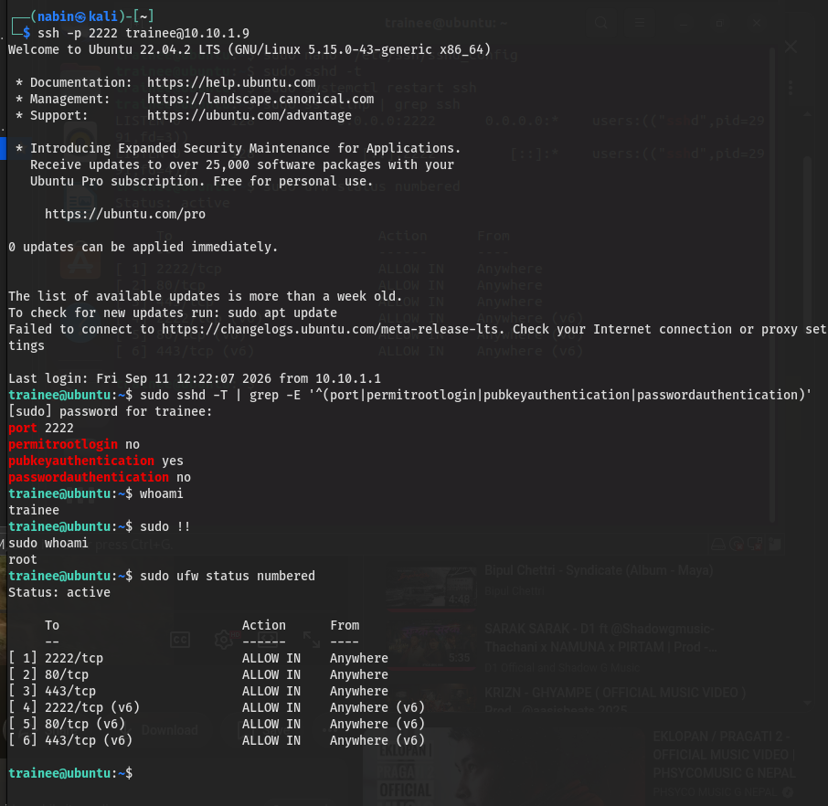
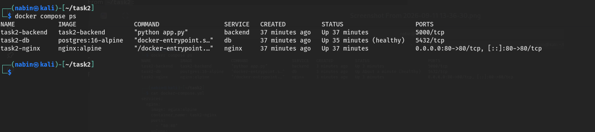
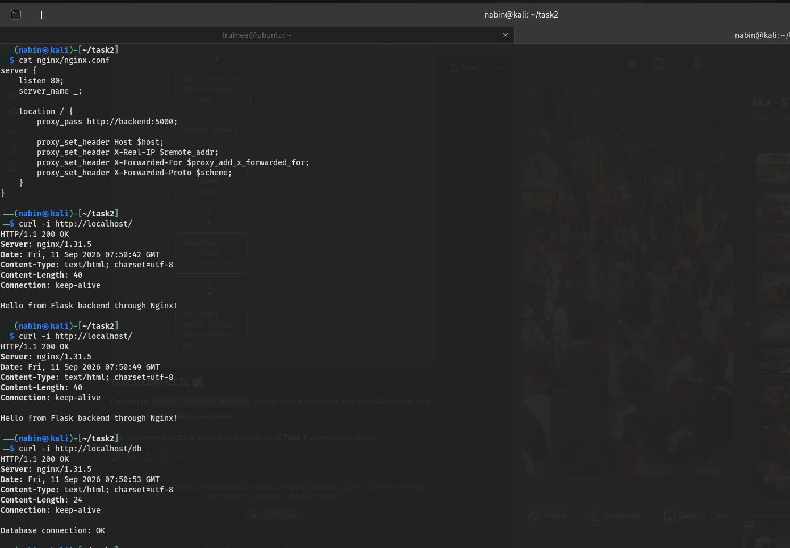
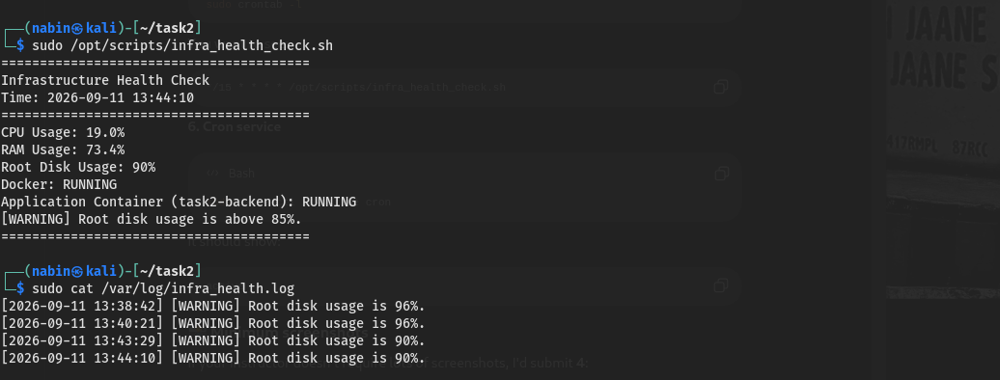

# DevOps Project

This project is a simple DevOps project that includes Docker, Nginx, Flask, PostgreSQL, Bash scripts, backups, monitoring, and Git.

## 1. Project Structure

```text
task2/
├── backend/
│   ├── Dockerfile
│   ├── app.py
│   └── requirements.txt
├── nginx/
│   └── nginx.conf
├── scripts/
│   ├── db_backup.sh
│   ├── infra_health_check.sh
│   └── metrics.py
├── docker-compose.yml
└── README.md
```

## 2. Start the Application

Go to the project folder:

```bash
cd ~/task2
```

Start all containers:

```bash
docker compose up -d --build
```

Check the containers:

```bash
docker ps
```

There should be three containers:

* Nginx
* Flask backend
* PostgreSQL database

## 3. Test the Website

Open a browser and go to:

```text
http://localhost/
```

Or use:

```bash
curl http://localhost/
```

Expected result:

```text
Hello from Flask backend through Nginx!
```

Nginx receives the request and sends it to the Flask backend.

## 4. Test the Database

Run:

```bash
curl http://localhost/db
```

Expected result:

```text
Database connection: OK
```

This shows that the Flask application can connect to PostgreSQL.

## 5. Stop the Application

To stop the containers:

```bash
docker compose down
```

To stop the containers and delete the database volume:

```bash
docker compose down -v
```

**Note:** `docker compose down -v` deletes the saved database data.

## 6. Check the Firewall

The firewall was configured on the Ubuntu system.

Check the firewall:

```bash
sudo ufw status verbose
```

The firewall should show as active.

## 7. Infrastructure Health Check

The health-check script is stored at:

```text
/opt/scripts/infra_health_check.sh
```

Run it:

```bash
sudo /opt/scripts/infra_health_check.sh
```

The script checks:

* CPU usage
* RAM usage
* Disk usage
* Docker status
* Flask application container status

If disk usage is above 85% or the application container is stopped, it shows a warning.

## 8. Health Check Log

Warnings are saved in:

```text
/var/log/infra_health.log
```

View the log:

```bash
sudo cat /var/log/infra_health.log
```

Example:

```text
[2026-09-11 13:38:42] [WARNING] Root disk usage is 96%.
```

## 9. Automatic Health Check

Cron runs the health-check script every 15 minutes.

Check the cron job:

```bash
sudo crontab -l
```

It should show:

```text
*/15 * * * * /opt/scripts/infra_health_check.sh
```

Check that cron is running:

```bash
sudo systemctl is-active cron
```

Expected result:

```text
active
```

## 10. Database Backup

The backup script is:

```text
/opt/scripts/db_backup.sh
```

Run the backup:

```bash
sudo /opt/scripts/db_backup.sh
```

Backups are saved in:

```text
/var/backups/db/
```

Check the backup:

```bash
sudo ls -lh /var/backups/db/
```

Example:

```text
db_backup_20260911.sql.gz
```

Check that the backup file is valid:

```bash
sudo gzip -t /var/backups/db/db_backup_20260911.sql.gz
```

## 11. Restore the Database

The database can be restored using:

```bash
gunzip -c /var/backups/db/db_backup_20260911.sql.gz | docker exec -i task2-db psql -U task2user -d task2db
```

This command extracts the backup and sends it to PostgreSQL.

## 12. Monitoring

A simple monitoring program was created using Flask.

It runs on port `8080`.

Check the metrics:

```bash
curl http://localhost:8080/metrics
```

Example:

```json
{
  "cpu_usage_percent": "18",
  "disk_usage": "90%",
  "ram_usage_percent": "74.3",
  "task2_backend_running": "true"
}
```

It shows CPU, RAM, disk usage, and application container status.

## 13. Monitoring Service

The monitoring program runs as a systemd service.

Check it:

```bash
sudo systemctl status metrics.service --no-pager
```

Check if it is running:

```bash
sudo systemctl is-active metrics.service
```

Expected result:

```text
active
```

## 14. Git

Git was used to keep track of the project.

The project uses these branches:

```text
main
feature/docker-setup
feature/scripts
```

Docker setup was added with:

```text
Add Docker application stack
```

Scripts were added with:

```text
Add infrastructure and backup scripts
```

The script branch was merged into `main`.

Check the Git history:

```bash
git log --oneline --all --decorate
```

## 15. Screenshots

The following screenshots are included for the project:

### Firewall Status



### Running Docker Containers



### Reverse Proxy Application



### Infrastructure Health Check




## 16. Final Result

The project successfully demonstrates:

* Linux administration
* Firewall configuration
* Docker containers
* Nginx reverse proxy
* Flask application
* PostgreSQL database
* Bash scripting
* Cron automation
* Database backup
* Basic monitoring
* Git branches and commits
